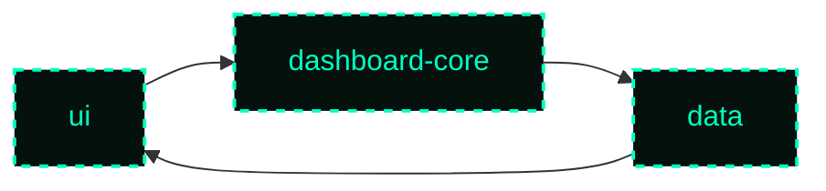
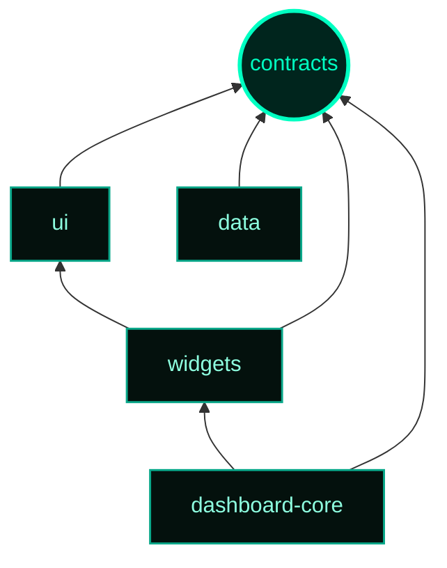

---

title: "Dependency Direction Should Be Enforced, Not Documented"
excerpt: "Architecture rules like 'don't import upward' are easy to ignore. Turn dependency direction into an executable constraint that CI can actually enforce."
date: "2026-09-06"
author: "Junior Oliveira"
tags: ["Architecture", "Monorepo", "TypeScript", "Design Patterns"]
readTime: "5 min read"
---

Every growing monorepo eventually develops dependencies nobody actually designed.

A low-level package quietly starts importing a higher-level orchestration package because it was the fastest way to ship one feature. The PR looks harmless. The code works. Tests pass.

Then another package follows the same pattern.

Six months later, changing the supposedly low-level package breaks half the application, and nobody remembers why those layers became connected in the first place.



*Nobody drew this on a whiteboard. It happened one PR at a time.*

You can document a rule saying:

> Lower-level packages must not import higher-level packages.

But if the repository itself doesn't enforce that rule, you're relying on every developer — and now every AI coding agent — to remember it every time they make a change.

That's not an architectural boundary.

That's a suggestion.

## If a rule can be checked, check it

Documentation is useful for expressing architectural intent: *why* a boundary exists, who owns it, and what trade-offs led to it.

But some architectural decisions can be verified mechanically.

Dependency direction is one of them.

Instead of asking reviewers to notice an invalid import buried inside a large PR, define the allowed dependency graph explicitly and make CI reject anything outside it.

The structure can be intentionally simple:

**A zero-dependency vocabulary layer** — one package, call it `contracts`, contains the stable types, schemas, identifiers, and shared vocabulary used across the system. It depends on nothing.

**An explicit dependency policy** — architecture defines which internal packages each package is allowed to depend on.

**Validation against reality** — the checker reads the dependencies actually declared by each package and compares them with that policy.

**A failing build** — violations aren't warnings or review comments. They fail CI.

The important distinction is that the architectural policy and the repository state are not the same thing.

One says what **should** be allowed.

The other says what **currently exists**.

CI compares the two.

## The dependency graph

Imagine a simplified dashboard monorepo with this intended structure:



Every dependency moves toward lower-level packages.

`contracts` sits at the bottom.

It can be imported by everyone, but it imports none of them.

The architectural policy representing that graph might look like this:

```javascript
const ALLOWED_DEPENDENCIES = {
  contracts: [],
  ui: ['contracts'],
  data: ['contracts'],
  widgets: ['contracts', 'ui'],
  'dashboard-core': ['contracts', 'widgets']
};
```

This map is not meant to duplicate `package.json`.

It represents something different.

It represents **architectural permission**.

The actual dependencies still come from each package's real `package.json`.

The checker compares reality against the policy:

```javascript
for (const packageName of workspacePackages) {
  const declaredDependencies = readPackageDependencies(packageName);
  const allowedDependencies =
    new Set(ALLOWED_DEPENDENCIES[packageName] ?? []);

  for (const dependency of declaredDependencies) {
    if (
      isInternalPackage(dependency) &&
      !allowedDependencies.has(dependency)
    ) {
      throw new Error(
        `'${packageName}' depends on '${dependency}', but that ` +
        `relationship is not allowed by the architecture.`
      );
    }
  }
}
```

Now there are two independent sources of information:

```text
Architecture policy
        ↓
what dependencies are allowed

package.json
        ↓
what dependencies actually exist

        ↓

       CI
        ↓
does reality still match the architecture?
```

That's the useful part.

The checker isn't trusting a manually maintained list to tell it what the repository currently does. It reads that from the repository itself.

The allow-list only answers the architectural question:

**Is this relationship supposed to exist?**

## Why `contracts` matters

A dependency graph becomes much easier to control when packages don't need to depend on each other just to share vocabulary.

Suppose both a chart-rendering package and a data package need to understand a `DashboardWidget`.

Without a neutral contract layer, one of them may eventually import the type from the other:

```text
widgets ──────→ data
```

That dependency may exist only because one package happened to define the type first.

Move the shared representation into `contracts` and the relationship becomes:

```text
widgets ──────→ contracts ←────── data
```

The packages can now agree on what a `DashboardWidget` is without knowing anything about each other's implementation.

That's why `contracts` has a particularly strict rule:

```text
contracts
    ↓
zero internal dependencies
```

If the vocabulary layer starts importing the systems that consume its vocabulary, the direction collapses.

## The important failure case

Now imagine someone is implementing a feature in `dashboard-core`.

The easiest solution requires importing something directly from `data`.

They add:

```javascript
import { loadDataset } from '@app/data';
```

Locally, everything works.

But the intended graph says:

```text
dashboard-core
      ↓
   widgets
      ↓
  contracts
```

There is no approved relationship:

```text
dashboard-core ──→ data
```

CI fails.

That's not the checker being annoying.

It's the checker identifying an architectural decision hiding inside an implementation change.

At that point there are several possibilities.

Maybe the functionality belongs somewhere else.

Maybe a shared contract is missing.

Maybe `dashboard-core` really should depend on `data`.

The checker doesn't know which answer is correct, and it shouldn't.

Its job is simply to prevent this:

```text
developer needs something
        ↓
adds an import
        ↓
architecture changes accidentally
```

and turn it into this:

```text
developer needs something
        ↓
adds an import
        ↓
CI rejects the relationship
        ↓
architecture must be reconsidered
        ↓
dependency is approved or implementation changes
```

## The architecture is allowed to change

This is an important distinction.

The goal isn't to make the dependency graph immutable.

Architectures evolve. New requirements appear. A dependency that didn't make sense six months ago may make perfect sense today.

If `dashboard-core` genuinely needs to depend on `data`, change the policy.

But now the architectural change is visible.

Instead of hiding inside a 400-line implementation PR, reviewers see something like:

```diff
const ALLOWED_DEPENDENCIES = {
  contracts: [],
  ui: ['contracts'],
  data: ['contracts'],
  widgets: ['contracts', 'ui'],
- 'dashboard-core': ['contracts', 'widgets']
+ 'dashboard-core': ['contracts', 'widgets', 'data']
};
```

That one line asks a much more useful question than the import itself:

> **Do we actually want this architectural relationship to exist?**

That's the purpose of enforcement.

Not preventing architectural change.

**Making architectural change explicit.**

## Documentation and enforcement solve different problems

In the previous article, I argued that documentation should be the source of truth for architectural intent, especially when AI agents are modifying a codebase.

That doesn't mean every architectural rule should live only in Markdown.

Documentation can tell an agent:

> `contracts` must remain independent because it defines vocabulary shared across subsystems.

But if a script can prove whether `contracts` has internal dependencies, there's no reason to rely on the agent remembering that instruction.

The documentation explains the decision.

The repository enforces the constraint.

```text
Documentation
      ↓
defines intent

Architecture policy
      ↓
defines allowed relationships

Repository
      ↓
contains actual relationships

CI
      ↓
compares the two
```

This becomes even more useful with AI-assisted development.

An agent can generate code quickly enough that relying entirely on human review to preserve architectural boundaries doesn't scale particularly well.

Give the agent the documentation so it understands the architecture.

But wherever possible, give the repository the ability to say **no**.

We're using this approach in a production dashboard monorepo: a zero-dependency `contracts` package, explicit dependency boundaries, validation against each package's real dependencies, and CI that fails when a package crosses a boundary that hasn't been approved.

The principle behind it is simple:

**If an architectural rule can be mechanically verified, don't rely on someone remembering it. Enforce it.**
