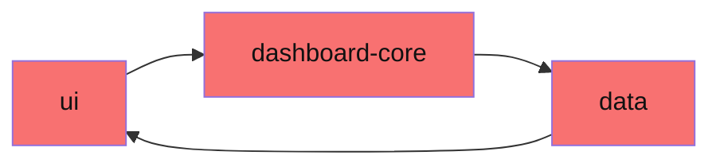
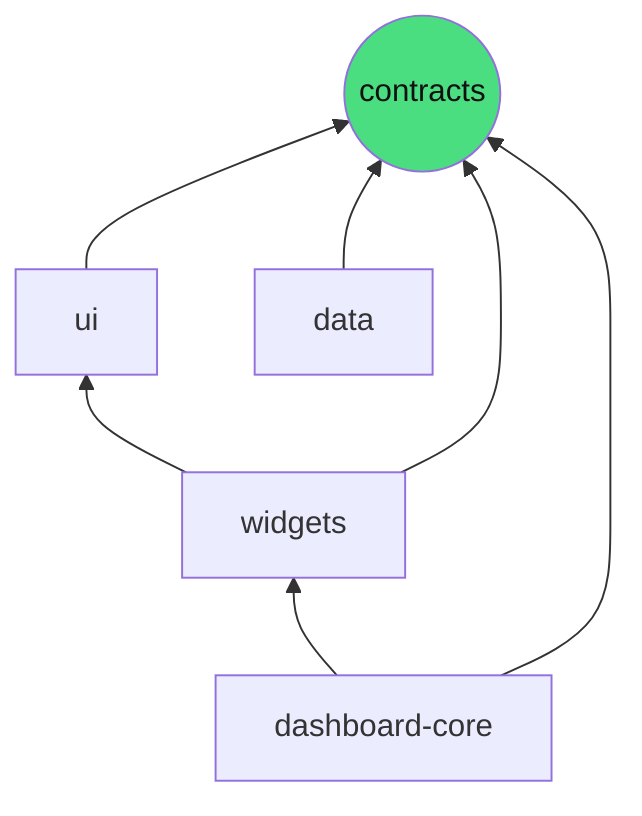

Every growing monorepo hits the same failure mode: a low-level utility package quietly starts importing a high-level orchestration package, because it was the fastest way to ship one feature. Nobody planned it. Six months later, refactoring the "low-level" package breaks half the app, and nobody remembers why they're connected.


*Nobody drew this on a whiteboard. It happened one PR at a time, and now nothing here can be changed in isolation.*

The fix is a **layered dependency graph** with one non-negotiable rule: dependencies only point one direction, and that direction is enforced by a script, not a wiki page.

🚀 Going straightforward to the shape of it:

**A zero-dependency vocabulary layer** – one package (call it `contracts`) holds shared types and schemas. It depends on nothing. Everything else is allowed to depend on it.

**Explicit, derived allow-lists** – which package may import which is written down once, and it's checked against each package's *real* dependencies — not maintained by hand somewhere it can quietly go stale.

**A failing build, not a code review comment** – the rule lives in CI. A violation doesn't wait for a human to notice it in a diff.

Here's the whole mechanism, stripped to its essentials:

```javascript
const ALLOWED_DEPENDENCIES = {
  contracts: [],
  ui: ['contracts'],
  data: ['contracts'],
  widgets: ['contracts', 'ui'],
  'dashboard-core': ['contracts', 'widgets']
};

function validateImport(packageName, importedPackage) {
  const allowed = new Set([packageName, ...ALLOWED_DEPENDENCIES[packageName]]);

  if (!allowed.has(importedPackage)) {
    throw new Error(
      `'${packageName}' imports '${importedPackage}', which is not in ` +
      `its allowed dependencies. Update ALLOWED_DEPENDENCIES (and the ` +
      `real package.json) if this is a legitimate new relationship.`
    );
  }
}

// Run over every import statement in every package at CI time —
// not a lint suggestion, a failing build.
```

That map *is* a graph — the same one enforced above, just drawn instead of written:


*Every arrow points down, toward `contracts`. Nothing points back up. That's the whole rule, in one picture.*

Notice what `contracts` buys you: it's the one package every other layer is allowed to speak, but it never has to speak back. A chart-rendering package and a data-fetching package can share a `DashboardWidget` type without ever depending on each other directly — they both just depend on `contracts`.

The map itself is small on purpose. If `dashboard-core` starts needing something from `data` directly instead of going through `contracts`, that's not a bug in the checker — it's a real architectural decision that now has to be made *on purpose*, by editing one line everyone can see in review, instead of happening by accident in a 400-line PR.

**Note:** this is the actual dependency-boundary check we run in CI for a production dashboard monorepo — a `contracts` package with zero dependencies, every other package's allow-list derived straight from its own `package.json`, and a script that fails the build the moment an import crosses a line nobody approved.
